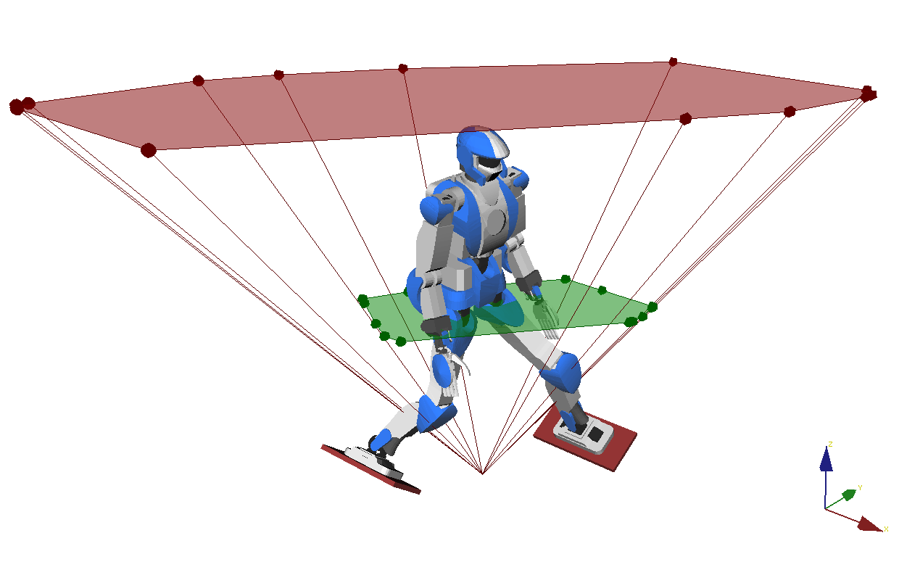

# Acceleration cones

Play with the acceleration cones computed for a given contact set. You can move
contacts around using the OpenRAVE GUI (cones will be updated live).

- [comdd.py](comdd.py) shows the upright cone of feasible COM accelerations.
  Move the green box around to see the link between accelerations on
  feasible contact forces.

- [vrp.py](vrp.py) shows the (equivalent) cone of feasible [Virtual Repellent
  Points](http://dx.doi.org/10.1109/TRO.2015.2405592) (VRP). This one is
  downward pointing as the point is repulsive. Move the green box around to see
  the link between VRP on feasible contact forces.

Note that both cones are derived in the Pendulum Mode of the equations of
motion, where the angular momentum at the center-of-mass is kept constant.

