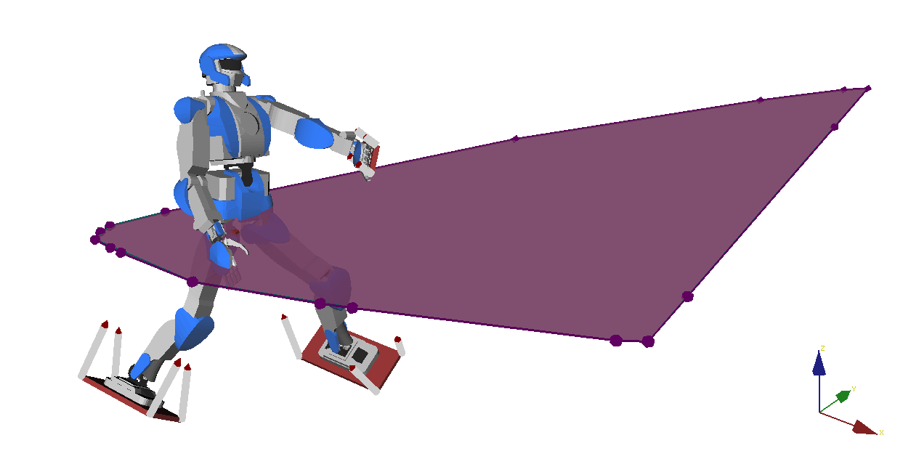

# Static-equilibrium polygon

Compare four methods to compute the static-equilibrium polygon (SEP). This
directory contains two scripts:

- Run [benchmark.sh](benchmark.sh) to log computation times for all methods on
  randomly-generated contact sets. Results will be stored in the [logs/](logs/)
  folder and displayed after computations.

- Run [sep.py](sep.py) to show the SEPs computed by all methods. They should
  all coincidate.



## Installation

To run the benchmark, you will need Python bindings for both CDD and PPL:

```
sudo apt-get install python libppl-dev python-matplotlib
sudo pip install pycddlib pyparma
```
