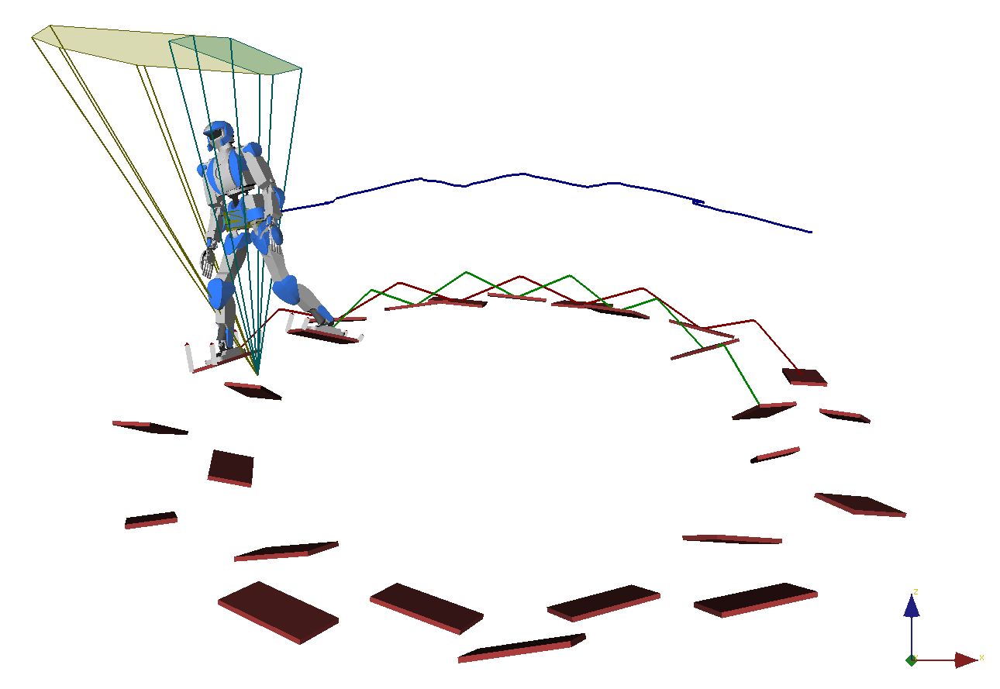

# Circular staircase

Run [walk.py] for the simulations described in Section VI.B of the paper.
Supporting contact forces are computed at each time instant: in case of
failure, the skyblue background becomes red. When supporting forces are found
again, the red background takes a "tainted" color between red and blue.

